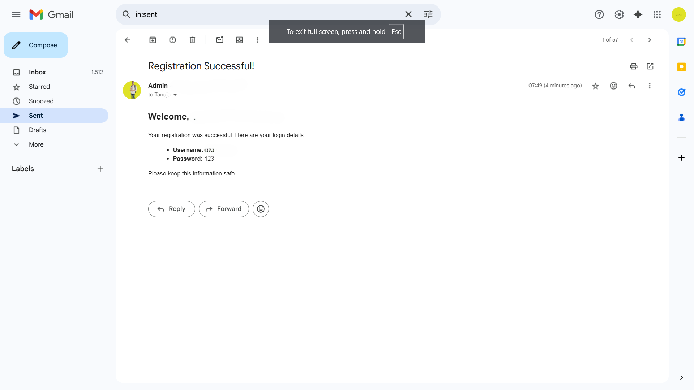
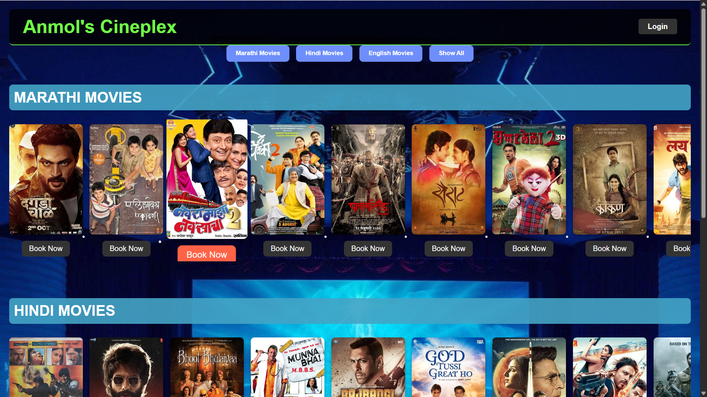
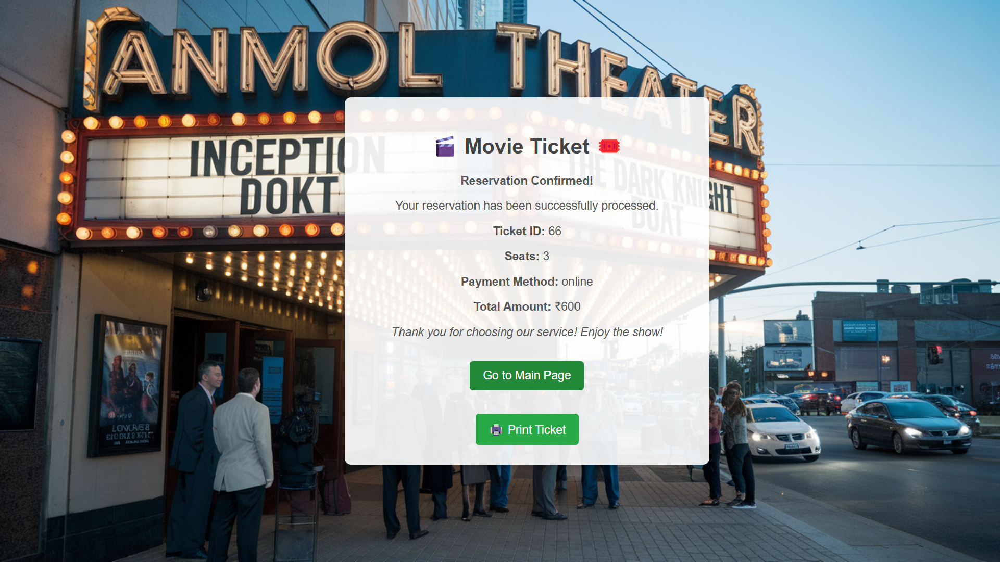
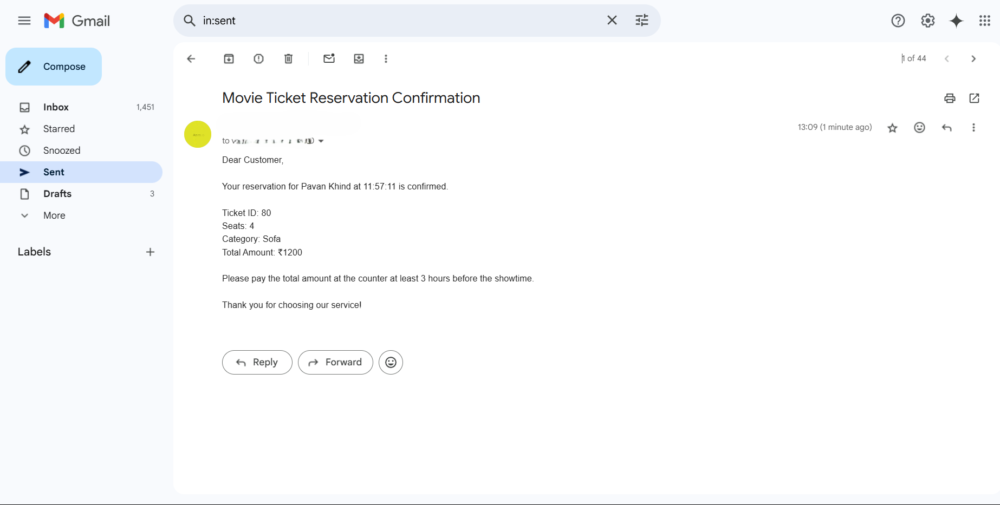
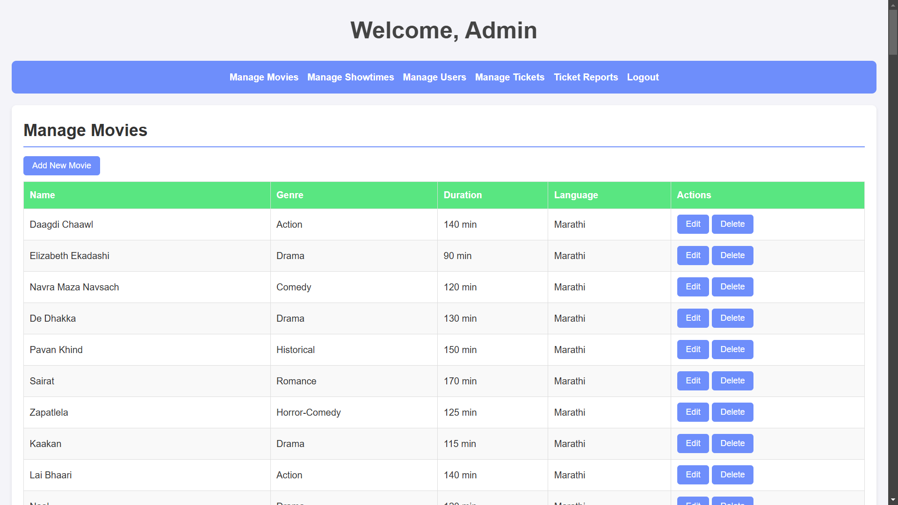
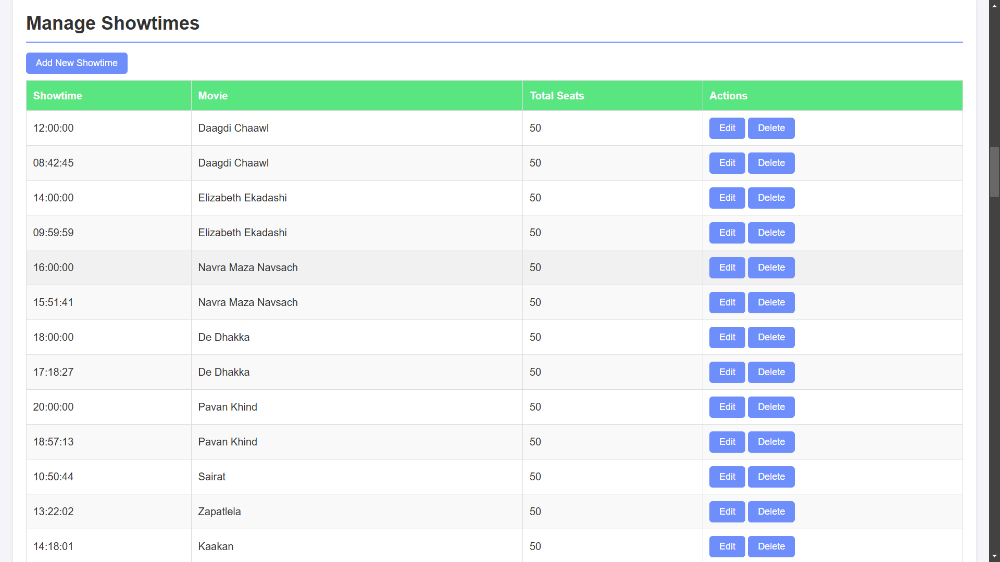
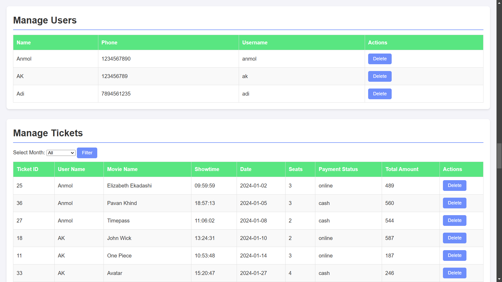
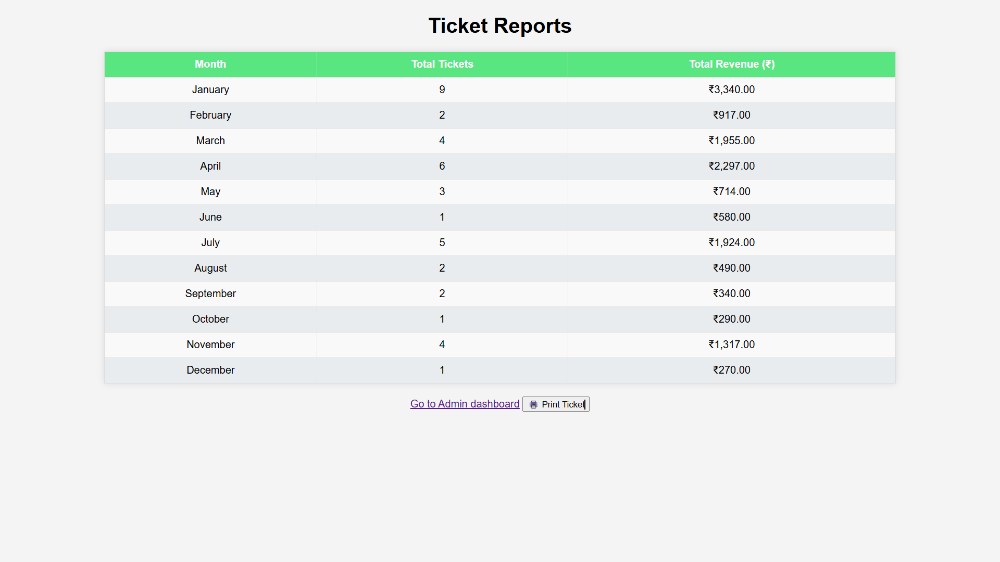

# 🎬 Movie Ticket Reservation System

This is a **Movie Ticket Reservation System** developed using **PHP, MySQL, HTML, CSS**.  
It allows users to book movie tickets online and provides a powerful admin panel to manage movies, users, showtimes, and ticket reports.

---

## ✨ Features

### 👤 User Panel

- **Single Login Page** for both Admin and User  
- After login:
  - **User Dashboard** is displayed first
  - Select a movie and view **Movie Description & Showtimes**
  - Book ticket by choosing:
    - Number of seats  
    - Payment mode (cash/online)
  - Confirm Ticket and view final ticket details:
    - Seat numbers  
    - Amount  
    - Payment status
  - Option to **Print or Download Ticket as PDF**
- **Email Confirmation** sent for:
  - New user registration
  - Ticket booking confirmation

---

### 🔐 Admin Dashboard

- **Manage Movies** – Add, edit, delete movies
- **Manage Users** – View or delete registered users
- **Manage Tickets** – View and manage all booked tickets
- **Manage Showtimes** – Set and update showtimes for movies
- **Filter & Reporting**:
  - Filter tickets by **day, month, year**
  - Generate **yearly collection reports**

---

## 📧 Email System

Mail feature is integrated for:

- Sending credentials upon registration
- Sending ticket confirmation details

> ⚠️ **Important:**  
> To enable mailing, generate your own **email password (App Password / SMTP Key)** and add it in the mail config file of the code.

---

## 🛠️ Tech Stack

- **Frontend**: HTML, CSS, Bootstrap, JQuery  
- **Backend**: PHP  
- **Database**: MySQL  
- **Mailing**: PHPMailer or similar SMTP library (with secure mail key)

---

## 📷 Screenshots

> Make sure your screenshot images are placed in a `screenshots/` folder inside the repo.

### 🔐 Login Page  
{: width="500" }

### 🛠️ Mail For New User
{: width="500" }

### 🏠 User Dashboard  
{: width="500" }

### 🧾 Movie Details  
{: width="500" }

### 🎟️ Ticket Booking  
{: width="500" }

### 🛠️ Mail for Confirm Ticket
{: width="500" }

### 🛠️ Admin Panel  1
{: width="500" }

### 🛠️ Admin Panel  2
{: width="500" }

### 🛠️ Admin Panel  3
{: width="500" }

### 🛠️ Admin Tickets Reports
{: width="500" }

---

## 🚀 How to Run

1. Clone or download the repository.
2. Import the SQL database (`db.sql` or similar) into **phpMyAdmin**.
3. Update your email password (SMTP key) in the mail config section and change localhost for databases connecctions.
4. Host the project on **XAMPP** or any local server.
5. Open `index.php` to start using the system.

---

## 📌 Note

This is a **static + dynamic hybrid PHP project**, built for **academic and learning purposes**.  
No frameworks were used, making it easy to understand and modify.

---
